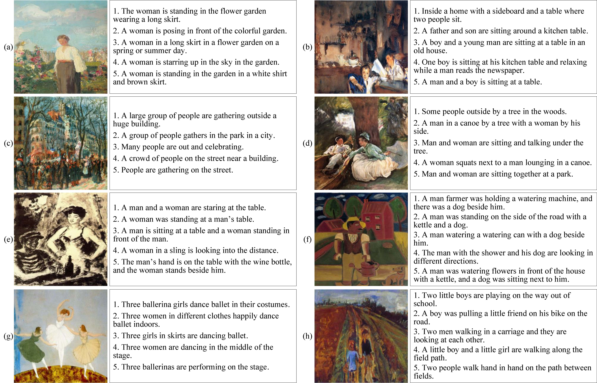

# ArtCap: A Dataset for Image Captioning of Fine Art Paintings

## Abstract

The image captioning of fine art paintings aims at generating content descriptions for the paintings. Due to the complexity of modeling both image and language, this task usually needs sufficient training data. However, different from photographic image captioning, there are few satisfactory datasets for painting captioning. In this article, we introduce a painting captioning dataset (named the ArtCap dataset), which contains 3606 paintings and five descriptions for each painting. We present the carefully designed construction pipeline of our dataset and further evaluate our dataset from two aspects of annotation quality and application effectiveness, respectively. For the annotation quality, we compare the global characteristics, annotation content, and annotation consistency of our dataset with other painting descriptions datasets. For application effectiveness, we employ our dataset and other painting descriptions datasets to train image captioning models and analyze the captioning performances. The results demonstrate the promising annotation quality and application effectiveness of our dataset.

## Download

The images and annotations are available from:

https://drive.google.com/drive/folders/1l8NK8mvpkG3UfrTuTNyBZciIjFquV2ia?usp=sharing

## Paper

```
Lu Y, Guo C, Dai X, et al. ArtCap: A Dataset for Image Captioning of Fine Art Paintings[J]. IEEE Transactions on Computational Social Systems, 2022.
```

Available：[ArtCap: A Dataset for Image Captioning of Fine Art Paintings | IEEE Journals & Magazine | IEEE Xplore](https://ieeexplore.ieee.org/abstract/document/9965360/)

## Details

we enroll Impressionism genre paintings and Expressionism genre paintings from the WikiArt dataset to construct our Art-Cap dataset. As a result, our ArtCap dataset contains 3606 paintings, including 2470 Impressionism genre paintings and 1136 Expressionism genre paintings, where each painting is annotated with five descriptions.

The examples of ArtCap dataset is as follows:



## Citation

```
@article{lu2022artcap,
  title={ArtCap: A Dataset for Image Captioning of Fine Art Paintings},
  author={Lu, Yue and Guo, Chao and Dai, Xingyuan and Wang, Fei-Yue},
  journal={IEEE Transactions on Computational Social Systems},
  year={2022},
  publisher={IEEE}
}
```


